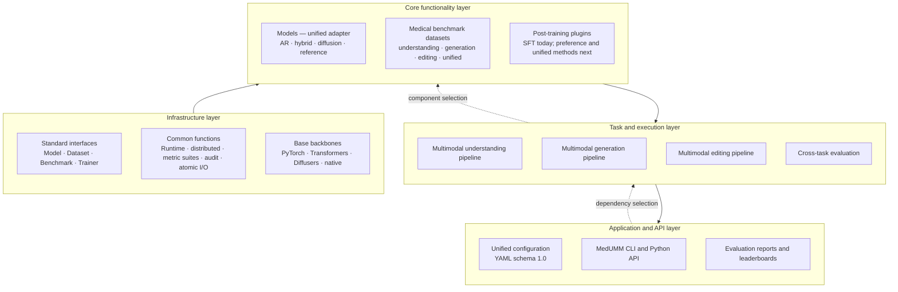

# MedUMM architecture and interface contract

MedUMM separates stable platform contracts from fast-changing model and
benchmark integrations. Dependencies flow downward; data and result objects
flow upward.



## Stable in v0.2

The following names and serialized fields form the v0.2 compatibility surface:

- `TaskType`, `Modality`, `ArchitectureFamily`, `EvaluationMode`, and
  `ModelCapabilities`;
- `InferenceRequest`, `InferenceResult`, `EvaluationResult`, `TrainingResult`,
  and `Artifact`;
- `ModelAdapter`, `DatasetAdapter`, `BenchmarkAdapter`, and `PostTrainer`;
- `registry.models`, `registry.datasets`, `registry.benchmarks`, and
  `registry.trainers`, plus the generic `register/create/names` facade;
- `InferencePipeline`, `EvaluationRunner`, `PostTrainingRunner`, and the
  high-level `infer/evaluate/post_train/catalog` functions;
- configuration and result schema version `1.0`.

A minor release may add optional fields or enum values. Removing a field,
changing its meaning, or making an optional field required needs a new schema
version and a migration path. Model-specific settings below `config` and
`parameters` are plugin-owned and are not part of the common compatibility
promise.

## Layer 1: application and API

All YAML files use one top-level execution block: `inference`, `evaluation`, or
`post_training`. `runtime` carries cross-cutting execution preferences. The
same in-memory config can be passed to the Python API, so CLI and Python calls
share orchestration rather than duplicating it.

Every CLI run has a `RuntimeContext` and emits a manifest. Reports are ordinary
JSON/JSONL/CSV artifacts so results can be inspected without importing MedUMM.

## Layer 2: task and execution

Understanding, generation, and editing are distinct `TaskPipeline` classes.
Each validates the adapter's declared tasks, modalities, image count, and batch
limits before calling the model. Mixed-task input is grouped for execution and
returned in original request order.

Starting in v0.6, the execution axis and medical-semantic axis are explicit and
separate. `task: understanding` selects the image/text-to-text model method;
optional `medical_task` selects one of eight clinical intents such as
`anatomy_localization`, `diagnostic_reasoning`, or `report_generation`. A report
is text generated from medical evidence, so it remains on the text-output
understanding pipeline; the generic `generation` pipeline continues to mean
multimodal content generation such as text-to-image. This preserves the four
layer architecture while allowing task-specific data contracts and metrics.

Evaluation is a state machine:

```text
audit:    dataset -> schema/governance/provenance checks -> dataset_audit.json
generate: dataset -> requests -> model -> predictions.jsonl
score:    predictions.jsonl + references -> metrics and report
full:     generate missing predictions -> score
```

Dataset and model fingerprints prevent an old prediction cache from being
silently scored as a new run. `CrossTaskBenchmark` composes multiple registered
benchmarks and returns one `EvaluationResult` without knowing their internal
metrics.

The resolved protocol and metric-suite versions are part of the run fingerprint.
Workers select `items[rank::world_size]` and use rank-local artifact names;
`merge-predictions` rejects missing ranks, duplicate sample IDs, mixed
fingerprints, and unexpected sample counts before producing a canonical file.

## Layer 3: core functionality

Four lazy registries are the only plugin-discovery mechanism. Heavy libraries
are imported only when their plugin is created. A model adapter advertises
machine-readable capabilities before weights are loaded:

```python
capabilities = ModelCapabilities(
    tasks=frozenset({TaskType.UNDERSTANDING}),
    input_modalities=frozenset({Modality.TEXT, Modality.IMAGE}),
    output_modalities=frozenset({Modality.TEXT}),
    architecture=ArchitectureFamily.AUTOREGRESSIVE,
    supports_batching=True,
    max_batch_size=8,
    max_images=4,
)
```

Datasets normalize external records into benchmark-owned sample objects and
provide stable fingerprints. Benchmarks own request construction, parsing,
scoring, and aggregation. Trainers own model-specific optimization but return
the common `TrainingResult`.

## Layer 4: infrastructure

Abstract interfaces define lifecycle boundaries. `RuntimeContext` resolves the
project root, output directory, device preferences, rank, world size, and run
identity. `DistributedContext` understands both `torchrun` and Slurm variables,
provides deterministic data sharding, and offers an optional process barrier.

I/O writes JSON and JSONL atomically. Metric suites remain independent of model
code and expose per-sample scoring plus aggregation contracts. Medical data
audits run before weights are loaded. Backbone libraries are implementation
details behind adapters.

## Adding a component

### Model

1. Subclass `ModelAdapter` and declare `name` and `capabilities`.
2. Implement `load` and only the supported batch methods.
3. Register a lazy factory in `core/builtins.py` or from an external package.
4. Add a minimal config and test every advertised task.

### Dataset

1. Subclass `DatasetAdapter`.
2. Normalize source records in `load`.
3. Include content and selection settings in `fingerprint`.
4. Document provenance, license, access, de-identification, and split policy.

### Benchmark

1. Subclass `BenchmarkAdapter`.
2. Convert dataset samples to `EvaluationItem` objects.
3. Supply parser, per-item scorer, and summarizer to `EvaluationRunner`.
4. Support `generate`, `score`, and `full` unless the benchmark fundamentally
   cannot separate those phases.

### Post-training method

1. Subclass `PostTrainer`.
2. Write a self-describing checkpoint plus training artifacts.
3. Return `TrainingResult`; do not invent a method-specific CLI response.
4. Make distributed assumptions and data-governance requirements explicit.

## Medical expansion gates

A medical integration is not complete with code alone. It must declare data
provenance and intended use, reject unsupported modalities early, preserve
sample identifiers through reports, include a dependency-safe smoke test, and
state model/dataset licenses. Protected clinical data remains out of scope
until access control, de-identification, retention, and audit requirements are
defined.
