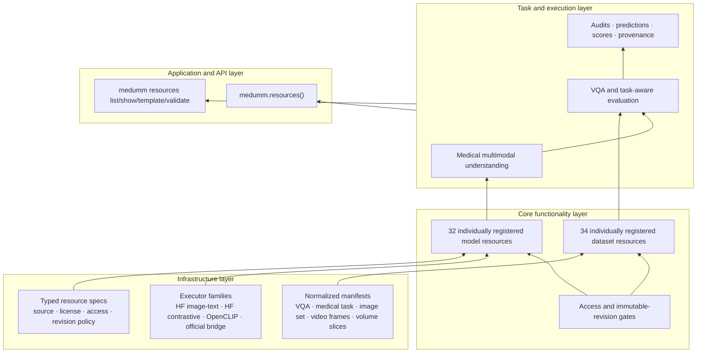

# v0.8 medical resource scale catalog

MedUMM v0.8 expands the platform to 32 medical multimodal model releases and
34 evaluation datasets. The catalog is curated, versioned, and executable; it
is not a claim to contain every medical artifact on the internet.

The initial selection was cross-checked against the official MedVLMBench and
MedEvalKit support lists, MultiMedEval's six-task/23-dataset evaluation scope,
the MedVision quantitative-image benchmark, primary papers, model cards, and
official repositories. Entries were kept when they contribute a useful medical
task/domain, have an identifiable primary source, and can be represented by the
stable MedUMM contracts.

## What “supported” means

Every entry carries one of three machine-readable states:

- `cataloged`: source and governance metadata are present, but no executable
  MedUMM interface is promised;
- `interface_validated`: the entry has its own registry name, typed spec,
  capability/adapter family, normalized input/output contract, and generated
  minimum config. This does **not** mean its weights or complete raw dataset
  have been downloaded;
- `runtime_validated`: in addition, a pinned real artifact has passed an
  acceptance run and has committed evidence.

v0.8 has 32 model and 34 dataset entries registered at the interface level.
Only `llava_med_v1_5_7b` and `vqa_rad` are marked `runtime_validated`, backed by
the v0.8 A800 acceptance evidence. Heavyweight models, gated weights, credentialed
clinical data, and source-specific metrics remain separate runtime-validation
work. This prevents catalog size from being reported as experimental coverage.

## Architecture

The scale catalog extends the same four-layer architecture; it does not add a
parallel execution system.



Models with modern Transformers interfaces use shared image-to-text or
contrastive executors. Upstream projects that require mutually incompatible
dependency stacks use `official_bridge`: a small MedUMM `ModelAdapter` in an
isolated environment, without copying the upstream repository into MedUMM.

Datasets keep their official distribution format outside the repository. A
dataset-specific registry entry consumes a locally prepared, source-pinned
manifest and adds catalog/source provenance to every normalized sample. VQA
resources default to `medical_vqa_jsonl`; other resources default to
`medical_tasks_jsonl`. `normalized_adapter` can override that choice when a
source offers multiple evaluation tracks.

## Model coverage

| Family | Integrated releases |
|---|---|
| Medical generative VLMs | MedGemma 4B/27B, LLaVA-Med, Med-Flamingo, RadFM, CheXagent, MAIRA-2, XrayGPT, HuatuoGPT-Vision 7B/34B, Lingshu 7B/32B/I-8B, VILA-M3, BiMediX2, HealthGPT-M3, BioMedGPT, MedDr, M3D-LaMed, MedMO 4B/8B, Fleming-VL, UniMed-VL, GMAI-VL, MedVLM-R1 |
| Medical contrastive encoders | BiomedCLIP, MedCLIP, PLIP, PubMedCLIP, MedSigLIP, UniMed-CLIP, QuiltNet |

This covers standard 2D images, multiple-view cases, ordered 3D slices, and
medical video at the request boundary. Not every upstream model implements all
modalities; each adapter advertises and enforces its own capability set.

## Dataset coverage

| Track | Integrated resources |
|---|---|
| Medical VQA/reasoning | VQA-RAD, SLAKE, PathVQA, PMC-VQA, OmniMedVQA, MedXpertQA-MM, MMMU Medical, GMAI-MMBench, PathMMU, Asclepius, MediConfusion, DrVD-Bench, MedBLINK |
| Safety/trust/fairness | CARES, FairVLMed10k |
| Reporting/grounding | GEMeX, IU X-Ray, MIMIC-CXR, CheXpert Plus |
| Quantitative/localization | MedVision, AbdomenAtlas 3.0 |
| Dermatology/ophthalmology/pathology | MM-Skin, HAM10000, PAPILA, GF3300, Camelyon17, DermaMNIST, OCTMNIST |
| Radiology classification | CheXpert, ChestX-ray14, PneumoniaMNIST, BreastMNIST |
| 3D/video | OrganMNIST3D, AbdomenAtlas 3.0, SurgMLLMBench |

Some collections reuse underlying images. A catalog entry does not grant the
right to those images. In particular, MIMIC-CXR, CheXpert, CheXpert Plus,
gated model weights, non-commercial datasets, and source collections with
per-constituent licenses must be obtained under their own terms.

## Commands

List resources without importing a heavyweight model library:

```bash
medumm resources list --kind model
medumm resources list --kind dataset
medumm resources show vqa_rad --kind dataset
```

Generate a minimal config containing revision and access placeholders:

```bash
medumm resources template lingshu_7b --kind model
medumm resources template mimic_cxr --kind dataset
```

Validate the catalog schemas and all individual plugin registrations:

```bash
medumm resources validate
```

Optionally probe source, paper, and official-code URLs without downloading
weights or data:

```bash
medumm resources validate --online \
  --field source --field paper --field official_code \
  --output outputs/verification/resource_urls.json
```

Online probing is reachability evidence only. HTTP 401/403 is considered
reachable because gated and credentialed resources intentionally require
authentication. A transient TLS or rate-limit failure does not change an
entry's runtime status; it is recorded for manual review.

The release audit reached all 188 populated source, paper, and official-code
URLs. `official_code` remains null where the authors did not publish a distinct
official repository; a paper, model card, benchmark implementation, or guessed
GitHub address is not mislabeled as upstream code.

## Normalized dataset boundary

An open VQA record uses the existing stable schema:

```json
{"id":"case-1","question":"What finding is present?","image":"case-1.png","answer":"opacity","modality":"xray","category":"finding","metadata":{}}
```

A task-aware record uses one of the eight v0.6 medical intents and can carry
structured concepts/evidence. Video is normalized to sampled ordered frames;
3D studies are normalized to ordered slices until a native tensor-volume
request type is introduced.

```yaml
evaluation:
  benchmark: medical_vqa
  data:
    adapter: vqa_rad
    path: data/vqa_rad/test.jsonl
    image_root: data/vqa_rad/images
    source_revision: osf:5b213a9886d8510012c26c09:v1
  model:
    backbone: llava_med_v1_5_7b
    config:
      model_path: /absolute/pinned/model/snapshot
      source_path: /absolute/pinned/official/source
  mode: full
```

For any non-open resource, `access_confirmed: true` is required after access
has actually been granted. Remote model identifiers require an immutable
`revision`; local pinned snapshots are accepted without network access.

## A800 acceptance evidence

Slurm job `437066` completed on an NVIDIA A800-SXM4-80GB with CUDA 12.6. It
ran every test, validated all 32 model and 34 dataset registrations, then used
the catalog aliases—not the underlying legacy names—to evaluate four official
VQA-RAD samples with pinned LLaVA-Med. The run recorded 15,211.37 MiB maximum
allocated GPU memory, 499.32 ms mean inference time, and 50.0% exact match.
This four-sample result validates wiring and provenance only; it is not a model
quality estimate. Machine-readable evidence is committed at
[`docs/results/v0.8-scale-catalog.json`](results/v0.8-scale-catalog.json).

The acceptance data came from the official VQA-RAD OSF deposit. The source
JSON is OSF file `5b213a9886d8510012c26c09`, version 1, with SHA-256
`948b7156059b864cf72344fb10669233526b175c243e5a046d20d4201d297a95`.
The exporter also records the canonical Hugging Face mirror revision for
cross-reference, but the executed samples and images were verified against
their OSF file hashes.

## v0.8 limits and next validation queue

- `interface_validated` is not a model-quality result or a clinical claim.
- Source-specific converters are still needed for raw formats that cannot be
  exported directly to the normalized manifest.
- Specialized Dice/IoU, physical measurement, temporal, report factuality,
  fairness, calibration, and robustness protocols must be validated before
  publishing cross-dataset leaderboards.
- The next runtime queue should deliberately diversify architecture and domain:
  one Qwen-derived medical VLM, one contrastive encoder, PathVQA, SLAKE, a
  reporting dataset, and a 3D or video benchmark.

MedUMM remains research software and is not a medical device.
